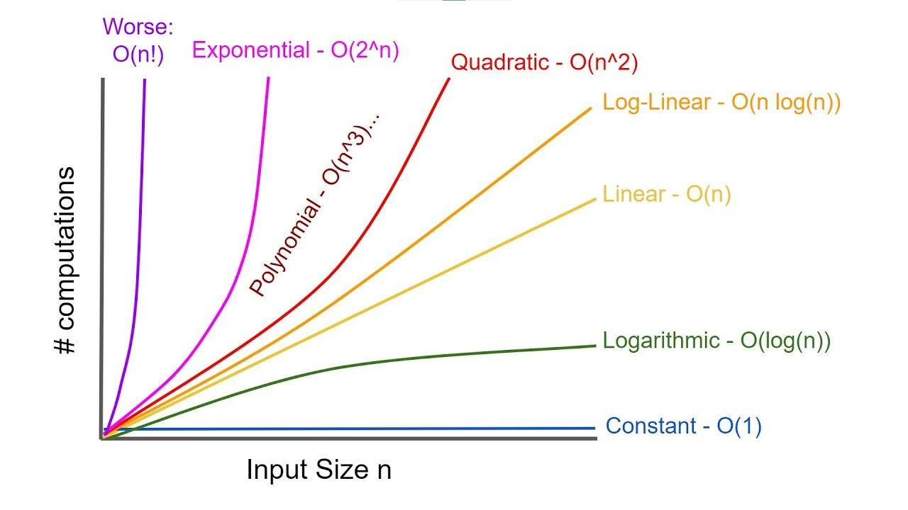

## Что такое О (о-большое)? Зачем и как используется?

О-большое - это математическая нотация, используемая для описания асимптотической сложности алгоритмов в худшем случае (верхняя граница времени или памяти).

Описывает рост времени выполнения алгоритма или используемой памяти в зависимости от размера входных данных (n).

Например, O(1) - константная сложность (время выполнения алгоритма не зависит от размера входных данных), O(n) - линейная сложность (время выполнения алгоритма линейно зависит от размера входных данных).

## Какая сложность основных операций в списках (массивах), словарях и множествах (хэшмапах)?

**Словари:**
- **удаление:** O(1), так как удаляем напрямую по адресу (хешу).
- **добавление:** в среднем O(1), так как добавляем напрямую по адресу. В худшем O(n), если требуется перехеширование при расширении коллекции.
- **поиск по адресу:** в среднем О(1), в худшем O(n) при большом количестве коллизий.
- **поиск перебором (`for x in set/dict.keys()`)**: О(n), так как перебираем все элементы, пока не найдем необходимый.

**Списки:**
- **поиск по индексу:** O(1), так как этот массив.
- **поиск перебором:** O(n).
- **вставка в начало/середину:** O(n), так как необходимо сдвинуть все остальные элементы вправо.
- **вставка в конец:** если есть свободное место, то O(1), если нет, то O(n), так как необходимо перевыделить непрерывный блок памяти бОльшего размера, скопировать все элементы туда и только потом добавить наш новый элемент.
- **удаление из начала/середины:** O(n), так как нужно сдвинуть все элементы влево.
- **удаление с конца:** O(1), так как сдвиг элементов не требуется.